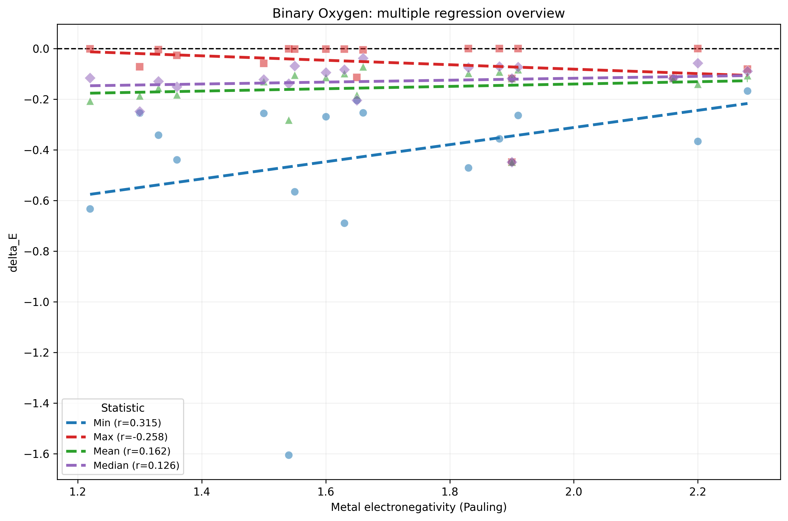
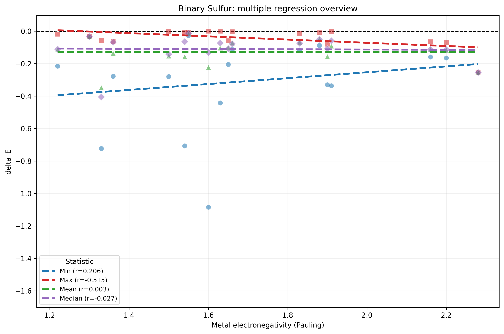
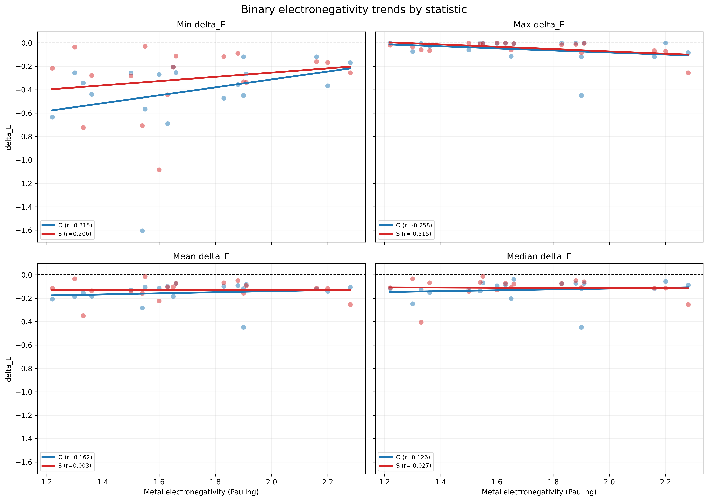
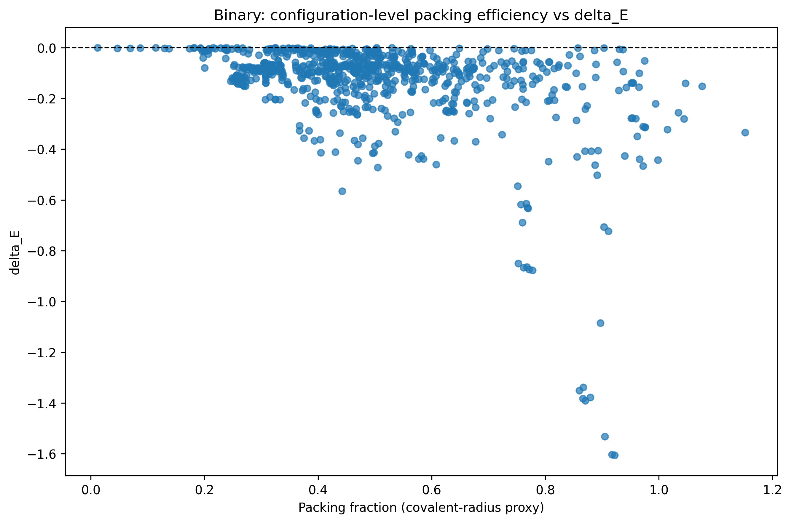
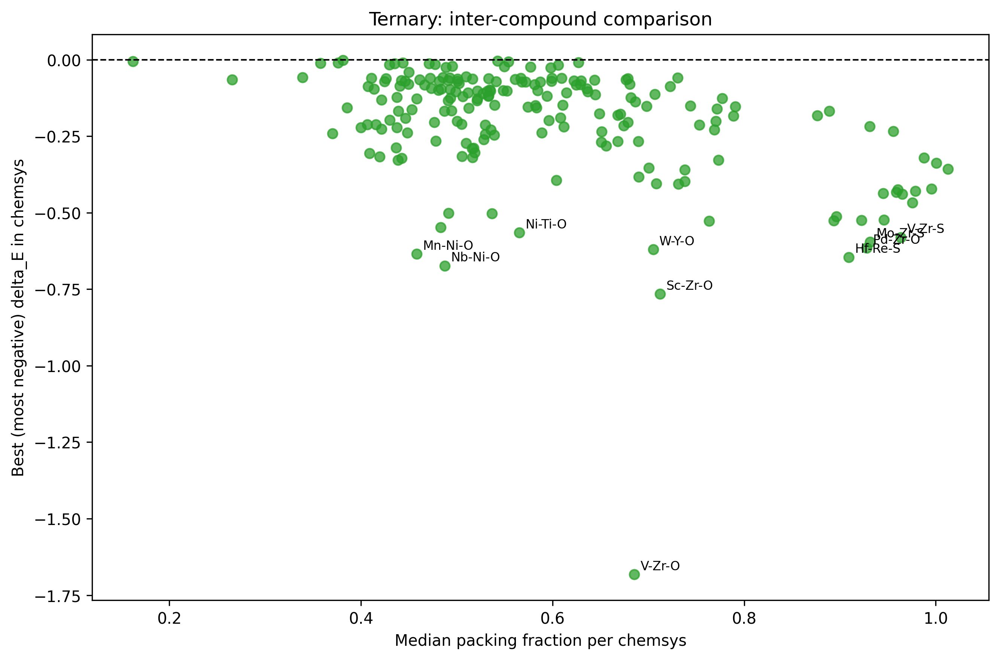
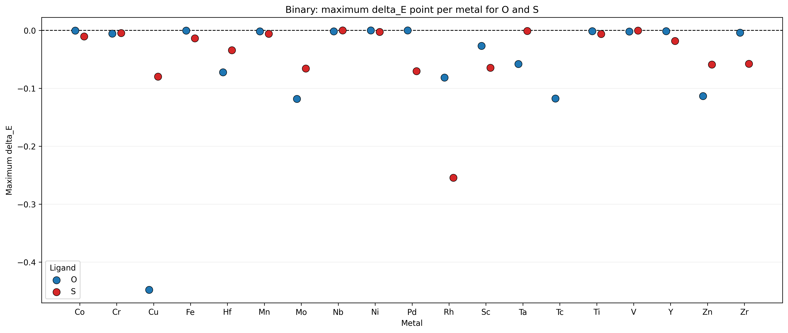

# delta_E Findings Discussion

This note summarizes three parts of the current analysis:

1. binary electronegativity vs `delta_E`
2. packing efficiency vs `delta_E`
3. maximum-`delta_E` point selection

The goal is to keep the main visual observations and the first-pass interpretation in one place while we refine the wording for a report or GitHub README.

## Figures used

### Binary electronegativity regressions

Source table:

- `tables/clean_regression_summary.csv`

### Packing efficiency plots

Source tables:

- `../packing_efficiency_results/binary/tables/chemsys_summary.csv`
- `../packing_efficiency_results/ternary/tables/chemsys_summary.csv`

### Maximum-`delta_E` selection plots

Source tables:

- `../max_delta_point_results/tables/binary_max_delta_points.csv`
- `../max_delta_point_results/tables/ternary_max_delta_points.csv`

## 1. Binary electronegativity regression findings

### Main regression summary

| Ligand | Statistic | Correlation (r) | Slope |
|---|---|---:|---:|
| O | min | 0.315 | 0.3384 |
| O | max | -0.258 | -0.0878 |
| O | mean | 0.162 | 0.0463 |
| O | median | 0.126 | 0.0378 |
| S | min | 0.206 | 0.1813 |
| S | max | -0.515 | -0.0990 |
| S | mean | 0.003 | 0.0008 |
| S | median | -0.027 | -0.0077 |

### What stands out

- The strongest trends appear in the extreme statistics, not in `mean` or `median`.
- For oxygen, the clearest trend is the positive slope in `min delta_E`.
- For sulfur, the strongest relation is the negative slope in `max delta_E`.
- Mean and median are weak for both ligands, so electronegativity alone is not a strong universal predictor of overall `delta_E` behavior.

### Interpretation

The electronegativity plots suggest a weak-to-moderate, statistic-dependent relationship rather than a single clean trend. The fact that the clearest signals sit in `min` and `max` indicates that electronegativity may affect the limiting behavior of the `delta_E` distribution more than its center.

## 2. Packing efficiency findings

### Key numerical summary

| System | Rows | Unique chemsys | Overall corr(packing_fraction, delta_E) |
|---|---:|---:|---:|
| Binary | 848 | 37 | -0.4156 |
| Ternary | 1186 | 198 | -0.4795 |

### Binary packing-efficiency observations

- The binary configuration-level plot shows a broad negative association between packing fraction and `delta_E`, but with substantial spread.
- The overall correlation is moderately negative (`-0.4156`), so higher packing often accompanies more negative `delta_E`, but not uniformly.
- Some systems show especially strong negative within-chemsys trends, including `Mn-S` (`-0.8895`), `V-S` (`-0.8381`), `Sc-O` (`-0.8347`), `Fe-S` (`-0.8190`), and `Ta-S` (`-0.7823`).
- There are also exceptions in the opposite direction, especially `Zn-O` (`0.9709`), `Hf-O` (`0.8925`), and `Zn-S` (`0.7103`), which means packing is informative but not sufficient by itself.

### Binary packing plot interpretation

The chemsys-level binary plot is important because it shows that high median packing does not guarantee a weak strain artifact. Some systems with quite high packing still show very negative best-case values:

- `Ti-O`: `delta_E_min = -1.6058`, median packing `0.6799`
- `Nb-S`: `delta_E_min = -1.0842`, median packing `0.5353`
- `Y-O`: `delta_E_min = -0.6327`, median packing `0.8187`
- `Cu-O`: `delta_E_min = -0.4482`, median packing `0.8055`

So the binary packing story is not "more packed means safer." It is closer to "packing often matters, but chemistry still controls which systems remain problematic."

### Ternary packing-efficiency observations

- The ternary configuration-level plot shows an even stronger overall negative relationship than the binary set, with correlation `-0.4795`.
- Oxygen ternaries span the deepest negative region, while sulfur ternaries appear more compressed vertically in the configuration-level scatter.
- Many of the strongest within-chemsys correlations in the ternary summary are exactly `+1` or `-1`, but those often come from only `2` configurations and should not be overinterpreted.

### Ternary packing plot interpretation

The ternary chemsys-level plot shows several severe outliers, many of them Zr-containing systems:

- `V-Zr-O`: `delta_E_min = -1.6825`, median packing `0.6852`
- `Sc-Zr-O`: `delta_E_min = -0.7656`, median packing `0.7122`
- `Nb-Ni-O`: `delta_E_min = -0.6737`, median packing `0.4876`
- `Hf-Re-S`: `delta_E_min = -0.6454`, median packing `0.9090`
- `W-Y-O`: `delta_E_min = -0.6203`, median packing `0.7051`

This is a strong sign that ternary chemistry can preserve large negative `delta_E` values even when the structures are quite densely packed.

### Packing-efficiency takeaway

Across both binary and ternary datasets, packing fraction has a clearer global relationship with `delta_E` than electronegativity does. Still, the scatter and the chemsys-specific reversals show that packing should be treated as one useful descriptor, not the whole explanation.

## 3. Maximum-`delta_E` point findings

These plots keep only the single numerically largest `delta_E` value in each category. Since most `delta_E` values are negative, this means the selected point is usually the least-negative or closest-to-zero value available for that system.

### Binary maximum-`delta_E` results

- selected rows: `37`
- minimum selected `delta_E`: `-0.4482`
- maximum selected `delta_E`: `-0.000039`
- median selected `delta_E` is about `-0.0106`

Most binary systems have a best retained point very close to zero, which means at least one strain point in each system often approaches negligible `delta_E`. But a few systems remain noticeably negative even in their best case:

- `Cu-O`: `-0.4482`
- `Rh-S`: `-0.2544`
- `Mo-O`: `-0.1184`
- `Tc-O`: `-0.1178`
- `Zn-O`: `-0.1136`

This makes `Cu-O` especially noteworthy because even its maximum selected value is still strongly negative.

### Ternary maximum-`delta_E` results

- selected rows: `198`
- minimum selected `delta_E`: `-0.6152`
- maximum selected `delta_E`: `-0.000137`
- median selected `delta_E` is about `-0.0658`

The ternary best-case values are generally worse than the binary best-case values. Even after selecting the maximum `delta_E` point from each ternary chemsys, a substantial number remain moderately or strongly negative.

The most negative selected ternary cases include:

- `Pd-Zr-O`: `-0.6152`
- `Mo-Zr-S`: `-0.5951`
- `V-Zr-S`: `-0.5805`
- `Fe-Zr-S`: `-0.5264`
- `Mo-Zr-O`: `-0.5232`
- `Re-Zr-O`: `-0.4672`

This again highlights the prominence of Zr-containing ternaries among the most persistent high-magnitude cases.

### Maximum-`delta_E` takeaway

The maximum-point plots are useful because they answer a different question from the full distributions: even if we keep only the best available point per system, how negative can that "best case" still be?

The answer is:

- for binaries, many systems recover to near zero
- for ternaries, the residual negative values are often larger and more persistent

## 4. Overall interpretation across all three analyses

Taken together, these figures point to a useful working picture:

- electronegativity shows only weak-to-moderate and statistic-dependent linear trends
- packing efficiency shows a clearer global negative association with `delta_E`
- ternary systems appear harder to "rescue" than binary systems, even when looking only at the maximum selected point
- some chemistries, especially several Zr-containing ternaries, repeatedly appear among the most negative cases

That suggests a report should probably frame electronegativity as a secondary descriptor, while giving more weight to structural descriptors and chemistry-specific motifs.

## 5. Suggested wording for a report

One concise way to describe the current findings is:

> Binary electronegativity shows only weak and statistic-dependent linear trends with `delta_E`, whereas packing efficiency shows a clearer overall negative association with `delta_E` in both binary and ternary datasets. Even so, densely packed systems can still exhibit large negative `delta_E`, indicating that packing alone does not determine the response. The maximum-`delta_E` analysis further shows that ternary systems often retain more negative best-case values than binary systems, with several Zr-containing ternaries emerging as persistent outliers.

## 6. Good next checks

- test robust regression for the electronegativity extremes
- compare packing fraction against other descriptors such as coordination or volume-per-atom
- separate ternary trends by ligand more explicitly in the markdown discussion
- check whether the recurring Zr-containing ternary outliers share the same structural motif or dip-detection pattern
